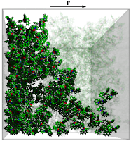
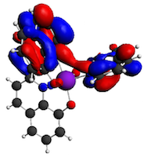

Summary
====================================================================================================
ToFeT is a numerical model of charge transport in molecular films, able to
simulate the time-of-flight experiment (ToF), field-effect transistors (FeTs), and 
potentially dark-injection.

As its input, ToFeT takes a description of the film at a molecular level: a
description of the position of all molecules (the morphology) and the
interactions between them (transfer integrals and energetics).  Currently,
ToFeT simply assumes that the rate of intermolecular charge transfer is
described by semi-classical Marcus theory.

As its output, ToFeT produces electrical characteristics such as mobilities, JV
curves, and photo-current transients.  ToFeT thus allows the *microscopic*
properties of a film to be related to its *macroscopic* electronic properties.

Further details of the methodologies used in ToFeT can be found in chapter 4 of
my thesis. This, and several papers produced with ToFeT, can be found at 
[www.joejk.com/writings](http://www.joejk.com/writings)

Detailed documentation 
====================================================================================================
* Is [here](https://htmlpreview.github.io/?https://raw.githubusercontent.com/joejk2/tofet/master/docs/index.html)

Credits
====================================================================================================
ToFeT was initially developed in the group of Professor Jenny Nelson at
Imperial College London, with key contributions from Dr. James Kirkpatrick. 

Please cite ToFeT with reference to [our Nanoletters paper](http://docs.google.com/viewer?a=v&pid=sites&srcid=am9lamsuY29tfGpvZS1rd2lhdGtvd3NraXxneDo1NjU1MDVjYjdhNmY5Njlh).
